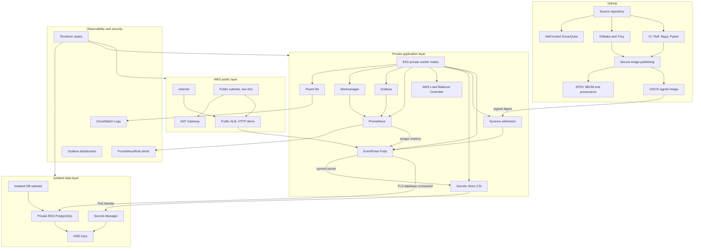

# EventPulse

EventPulse is a secure event-booking platform built as a DevOps and DevSecOps portfolio project, showing how a small FastAPI application can move from local development to signed containers, policy-controlled Kubernetes and an observable AWS EKS deployment.

## Current Status

The project has completed a validated AWS development platform milestone:

- FastAPI modular monolith with event browsing and transactional booking.
- PostgreSQL-backed capacity protection using database transactions and row locking.
- Multi-stage non-root Docker image published to GHCR by immutable digest.
- GitHub Actions CI, security scanning, SBOM, provenance and Cosign keyless signing.
- Helm and Kind validation before AWS deployment.
- Kyverno admission policies enforcing image and workload controls.
- AWS VPC, private EKS nodes, private RDS PostgreSQL, Secrets Manager and Pod Identity.
- Public demo access through a temporary HTTP ALB.
- Prometheus, Grafana, Alertmanager, Fluent Bit and CloudWatch logs.
- Point-in-time resilience validation and alert documentation.

This repository does not claim production traffic, HTTPS, DNS, WAF, Argo CD or multi-cloud deployment yet.

## Public Demo Status

The public ALB is a temporary validation endpoint and is normally removed outside demo windows to reduce cost and exposure. Do not treat any temporary ALB DNS name as a permanent product URL.

## Architecture



More detail:

- [AWS architecture](docs/architecture/eventpulse-aws-architecture.md)
- [Request flow](docs/architecture/request-flow.md)
- [Security boundaries](docs/architecture/security-boundaries.md)

## Engineering Outcomes

- Built a Python 3.12 FastAPI API with typed request/response models and central exception handling.
- Used PostgreSQL constraints and `SELECT ... FOR UPDATE` style locking to prevent overselling tickets.
- Published signed immutable container images with SBOM and GitHub provenance.
- Validated Kubernetes manifests locally with Helm, Kind and Kyverno before AWS deployment.
- Deployed EventPulse to private EKS worker nodes with a public ALB using IP targets.
- Delivered application metrics, dashboards, alert rules and CloudWatch log forwarding.
- Captured point-in-time validation: 31 tests passed with 86.62% coverage.

## Technology Stack

Application:

- Python 3.12
- FastAPI
- Pydantic
- SQLAlchemy
- Alembic
- PostgreSQL
- Pytest
- Ruff
- Mypy

Containers and supply chain:

- Docker multi-stage build
- GHCR
- SPDX SBOM
- GitHub provenance
- Cosign keyless signing

Kubernetes and AWS:

- Helm
- Kind
- Kyverno
- Amazon EKS
- AWS Load Balancer Controller
- AWS Secrets Manager
- Secrets Store CSI
- EKS Pod Identity
- Amazon RDS PostgreSQL
- KMS
- CloudWatch Logs

Observability:

- Prometheus
- Grafana
- Alertmanager
- kube-state-metrics
- node-exporter
- Fluent Bit

## Security And Supply Chain Controls

- GitHub Actions token permissions are restricted to read unless a workflow requires publishing.
- Third-party GitHub Actions are pinned to immutable commit SHAs.
- Gitleaks scans repository history and current changes.
- Trivy scans the repository filesystem and locally built image.
- SonarQube complements CI with maintainability and quality-gate feedback.
- Images are deployed by digest, not mutable tags.
- Cosign keyless signing ties the accepted image to the GitHub publishing workflow identity.
- Kyverno rejects unsigned, untrusted or policy-violating workloads.
- Runtime containers use non-root users, dropped Linux capabilities and read-only root filesystems where compatible.
- Secrets are sourced from AWS Secrets Manager and are not stored in Git.

## AWS Platform Architecture

The AWS platform uses separate Terraform states for network, EKS, data, platform controllers and observability. The dev environment includes:

- VPC across two Availability Zones.
- Public subnets for the ALB and NAT path.
- Private EKS worker nodes with no public IPs.
- Isolated RDS subnets for PostgreSQL.
- KMS encryption for EKS secrets and RDS.
- Secrets Manager for database credentials.
- Pod Identity for AWS API access from controllers and workloads.
- Security groups and NetworkPolicies limiting application and database traffic.

Runbooks:

- [AWS EKS operations](docs/runbooks/aws-eks-operations.md)
- [AWS RDS operations](docs/runbooks/aws-rds-operations.md)
- [AWS EventPulse deployment](docs/runbooks/aws-eventpulse-deployment.md)
- [AWS public ALB](docs/runbooks/aws-public-alb.md)

## Observability And Resilience

EventPulse exposes `/metrics` for Prometheus. The Helm chart can render a `ServiceMonitor` and `PrometheusRule` for the AWS deployment. Grafana dashboards cover request rate, 5xx ratio, latency, booking outcomes and Kubernetes workload health. Fluent Bit forwards EventPulse container logs to CloudWatch Logs.

Validated point-in-time outcomes include:

- EventPulse Prometheus target `UP`.
- Request and latency metrics present.
- CloudWatch log streams and events present.
- Resilience script replaced one Pod, waited for rollout recovery, scaled down temporarily and restored replicas.

Runbooks:

- [AWS observability](docs/runbooks/aws-observability.md)
- [Alert response](docs/runbooks/eventpulse-alert-response.md)

## Local Development

Create a virtual environment:

```bash
python3.12 -m venv .venv
```

Install development dependencies:

```bash
.venv/bin/python -m pip install -r requirements-dev.txt
```

Start local PostgreSQL:

```bash
docker compose up -d postgres
```

Run migrations and seed data:

```bash
.venv/bin/alembic upgrade head
.venv/bin/python -m app.scripts.seed_events
```

Run locally:

```bash
.venv/bin/uvicorn app.main:app --reload
```

Validate:

```bash
.venv/bin/ruff format --check .
.venv/bin/ruff check .
.venv/bin/mypy app
.venv/bin/pytest --cov=app --cov-report=term-missing --cov-report=xml --cov-fail-under=70
```

## CI And Security Workflows

GitHub Actions includes:

- `CI`: formatting, linting, typing, migrations, tests, coverage gate and Docker image build.
- `Security`: Gitleaks and Trivy filesystem/image scanning.
- `SonarQube`: trusted `main` branch analysis on a self-hosted runner.
- `Publish Secure Image`: GHCR publishing, SBOM, provenance and Cosign signing.

The publishing workflow does not run on pull requests. It is intentionally separated from normal validation.

## Kubernetes Deployment

The Helm chart is under `deploy/helm/eventpulse`. It supports:

- Immutable image digest deployment.
- ConfigMap and Secret separation.
- Migration and seed Jobs.
- HPA and PodDisruptionBudget.
- NetworkPolicies.
- ServiceMonitor and PrometheusRule.
- AWS Secrets Store CSI integration.
- ALB Ingress for AWS validation.

Local Kubernetes runbook:

- [Local Kubernetes deployment](docs/runbooks/local-kubernetes-deployment.md)

## AWS Deployment

AWS deployment is intentionally manual and documented so each component is understood before GitOps is introduced. Typical order:

1. Network Terraform state.
2. EKS Terraform state.
3. RDS/data Terraform state.
4. Platform controller Terraform state.
5. Secrets Store CSI and Kyverno.
6. EventPulse Helm release.
7. Public ALB validation.
8. Observability Terraform and Helm installation.

## Validation Evidence

Evidence guidance lives in:

- [Evidence README](docs/evidence/README.md)
- [Screenshot checklist](docs/evidence/screenshot-checklist.md)
- [Validation summary](docs/evidence/validation-summary.md)

Evidence files should not expose account IDs, secret ARNs, database endpoints, passwords, tokens or operator IPs.

## Repository Structure

```text
app/                         FastAPI application
alembic/                     Database migrations
deploy/helm/eventpulse/      Kubernetes Helm chart
docs/                        Architecture, runbooks, evidence and decisions
infrastructure/terraform/    AWS infrastructure states and modules
observability/               Grafana dashboards and alert notes
ops/                         Operational scripts for Kind, EKS and SonarQube
policies/                    Kyverno policies and tests
tests/                       Pytest suite
```

## Cost And Teardown Warning

AWS resources such as NAT Gateway, ALB, EKS, RDS, CloudWatch Logs and snapshots can keep generating cost. Use the shutdown runbook before leaving the environment idle:

- [Complete AWS shutdown](docs/runbooks/aws-complete-shutdown.md)

The Terraform bootstrap/state bucket is retained unless you intentionally choose permanent project deletion.

## Design Decisions And Runbooks

Architecture decisions are stored in `docs/decisions`. Operational guides are stored in `docs/runbooks`.

Start here:

- [AWS architecture](docs/architecture/eventpulse-aws-architecture.md)
- [Security boundaries](docs/architecture/security-boundaries.md)
- [Resume AWS environment](docs/runbooks/aws-resume-environment.md)

## Known Limitations

- Public demo uses HTTP, not HTTPS.
- No Route 53, ACM, WAF, CloudFront or custom domain yet.
- RDS is a dev-focused single-instance design, not a production HA database architecture.
- One NAT Gateway is used for cost-conscious learning.
- The public EKS endpoint is temporary and restricted during validation.
- Grafana is accessed by port-forward, not public SSO.
- No Argo CD/GitOps deployment yet.
- No GCP analytics platform yet.

## Roadmap

- Add HTTPS with ACM and Route 53.
- Add WAF and stricter public edge controls.
- Introduce Argo CD after Helm workflows are stable.
- Add GitOps promotion for image digest updates.
- Add managed long-term observability or log analytics.
- Add Google Cloud asynchronous analytics in a later phase.
