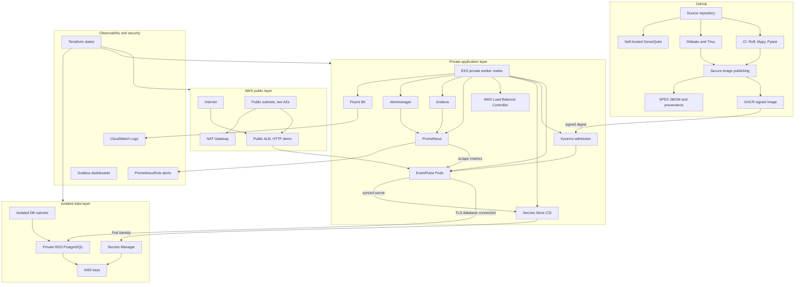

# EventPulse AWS Architecture

EventPulse is deployed as a FastAPI modular monolith on AWS EKS. The design is intentionally production-style but scoped for a portfolio/dev environment.

## Diagram

## Main Components

- **GitHub** runs CI, security checks, SonarQube analysis and secure image publishing.
- **GHCR** stores the immutable signed EventPulse image.
- **AWS VPC** separates public ALB subnets, private EKS worker subnets and isolated RDS subnets.
- **EKS** runs EventPulse, Kyverno, Secrets Store CSI, AWS Load Balancer Controller and observability workloads.
- **RDS PostgreSQL** stores events and bookings in private subnets.
- **Secrets Manager** stores database credentials consumed through Secrets Store CSI and Pod Identity.
- **KMS** encrypts EKS secrets and RDS storage.
- **Prometheus/Grafana/Alertmanager** provide metrics, dashboards and alert evaluation.
- **Fluent Bit** forwards EventPulse application logs to CloudWatch Logs.

## Trust And Data Paths

- Public users reach EventPulse through the temporary HTTP ALB.
- The AWS Load Balancer Controller reconciles Kubernetes Ingress into ALB resources.
- ALB uses IP targets to route directly to EventPulse Pod IPs.
- EventPulse connects to private RDS PostgreSQL using TLS.
- Database credentials come from Secrets Manager through Pod Identity and Secrets Store CSI.
- Prometheus scrapes EventPulse `/metrics`.
- Fluent Bit tails container stdout and sends EventPulse logs to CloudWatch.
- Kyverno verifies the signed image digest before admission.
- Terraform manages AWS infrastructure through separated state scopes.

## Non-Goals In This Architecture

- No HTTPS, Route 53 or WAF yet.
- No Argo CD/GitOps yet.
- No public Grafana.
- No production traffic claim.
- No multi-cloud deployment yet.
